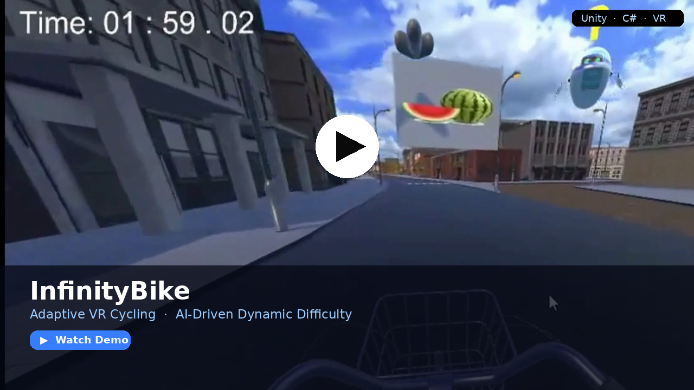

# 🚴 InfinityBike — Real-Time Dynamic Difficulty Adjustment in VR

> **Adaptive AI gameplay system** that continuously monitors player performance and adjusts difficulty, environments, and objectives in real time using fuzzy logic, behavior arbitration, and control-theory-inspired pacing.

Built with **Unity (C#)** · **VR (HMD-based)** · **AI-driven adaptation engine**

---

## 📹 Demo

[](media/demo.mp4)
*Click to download/watch the gameplay demo*

---

## 🎯 The Problem This Solves

Static difficulty in games and serious applications creates two failure modes: players disengage when it's too easy, or quit when it's too hard. Both kill outcomes — especially in therapeutic or training contexts.

InfinityBike solves this with a **closed-loop adaptive system** that keeps players in a state of flow by treating difficulty as a continuously controlled variable, not a fixed setting.

---

## 🧠 How the Adaptive Difficulty System Works

The core of this project is the **Dynamic Difficulty Adjustment (DDA) engine** — a layered real-time pipeline that responds to the player every frame:

```
Player Input → Sensor Layer → Metrics Extraction → Performance Scoring
     ↓
Adaptation Engine (Fuzzy Logic + Rule-Based Arbitration + PID-style Pacing)
     ↓
Gameplay Controller → Scene Updates → Adjusted Objectives + Environment
```

### 1. Sensor & Metrics Layer
- VR headset and controller tracking for motion quality and reaction time
- Bike input sensors for effort and cadence
- Task completion time, accuracy, and consistency metrics
- Outputs a continuous **performance score** per session window

### 2. Performance Classification
- Player state is classified into difficulty zones (underloaded, optimal, overloaded)
- Classification uses a **sliding window** over recent metrics to avoid reacting to noise
- Prevents the "rubber-band" effect where difficulty spikes abruptly

### 3. Adaptation Engine
This is where the AI logic lives:

| Component | Role |
|---|---|
| **Fuzzy Logic** | Smooth, human-readable difficulty transitions — avoids hard cutoffs |
| **Rule-Based Arbitration** | Resolves conflicts when multiple adaptation signals fire simultaneously |
| **PID-Style Pacing** | Stabilizes difficulty changes over time, prevents oscillation |

- Fuzzy membership functions map raw performance scores to soft difficulty levels
- Rules arbitrate between competing objectives (e.g., increase challenge vs. maintain engagement)
- The PID-inspired controller damps overshoot so transitions feel natural, not jarring

### 4. Gameplay Controller
- Scales environmental complexity (obstacles, layout changes, visual load)
- Adjusts task difficulty, timing windows, and objective complexity
- Modifies pacing in real time based on the current difficulty target

---

## ✨ Key Technical Highlights

- **Closed-loop feedback control** — difficulty is a continuously regulated output, not a discrete setting
- **Fuzzy logic for smooth transitions** — gradual, perceptually natural difficulty curves
- **Behavior arbitration** — clean resolution of competing adaptation priorities across multi-task environments
- **Low-latency VR interaction** — adaptation runs within the game loop without perceptible lag
- **Modular architecture** — sensor layer, analytics, adaptation engine, and gameplay controller are independently extensible

---

## 🛠️ Tech Stack

| Category | Tools |
|---|---|
| Engine | Unity |
| Language | C# |
| Platform | VR (HMD-based) |
| AI Methods | Fuzzy logic, rule-based systems, control theory |
| Design Pattern | Modular layered pipeline |

---

## 📂 Repository Structure

```
README.md
media/
    demo.png    # thumbnail
    demo.mp4    # gameplay video (download to watch)
```

> Source code is not included due to project IP restrictions.
> This repository documents system design, architecture, and demonstration.

---

## 🚀 Skills Demonstrated

This project is directly relevant to roles in:

- **Game AI / Gameplay Engineering** — DDA, behavior trees, real-time AI systems
- **ML / AI Engineering** — fuzzy inference, performance modeling, closed-loop control
- **XR / VR Development** — Unity, HMD integration, low-latency interaction
- **Serious Games / Human-Computer Interaction** — player-adaptive systems, engagement design
- **Control Systems** — PID-inspired stabilization applied to interactive AI

---

## 👤 Author

**Izabel Mohamed**
AI · Machine Learning · XR/VR · Intelligent Systems
[LinkedIn](https://www.linkedin.com/in/izabel-mohamed) · Ann Arbor, MI

---

## 📄 License

MIT License — educational and research use.
